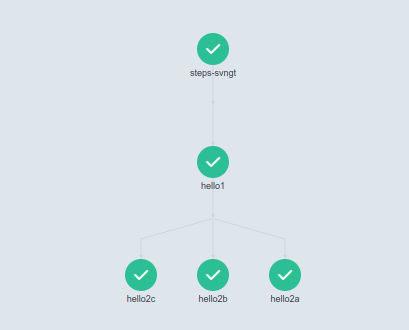
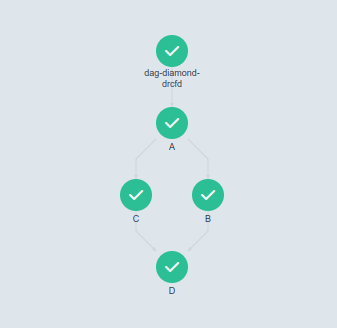

# 1.安装

打开网址  https://github.com/argoproj/argo-workflows/releases  ，参考里面的命令安装，类似下面

## 1.1 安装服务端

1.下载项目文件

```shell
git clone https://github.com/argoproj/argo-workflows.git 
```

```shell
argo-workflows/manifests$ kubectl create namespace argo
argo-workflows/manifests$ kubectl apply -n argo -f quick-start-postgres.yaml
```

```shell
# 可以看到部署了4个服务
kubectl get deployments -n argo

NAME                  READY   UP-TO-DATE   AVAILABLE   AGE
argo-server           1/1     1            1           3m11s
httpbin               1/1     1            1           3m11s
minio                 1/1     1            1           3m11s
postgres              1/1     1            1           3m11s
workflow-controller   1/1     1            1           3m11s

```

转发服务器端口以访问 UI

```
kubectl -n argo port-forward service/argo-server 2746:2746
```

打开网页 https://localhost:2746

卸载方式 `kubectl delete namespace argo`


备注：

```yaml
image: minio/minio:RELEASE.2022-11-17T23-20-09Z
#由于minio镜像下载失败，我改成了这样
image: minio/minio
```


## 1.2 安装CLI程序

```shell
# Download the binary
curl -sLO https://github.com/argoproj/argo-workflows/releases/download/v3.5.4/argo-linux-amd64.gz

# Unzip
gunzip argo-linux-amd64.gz

# Make binary executable
chmod +x argo-linux-amd64

# Move binary to path
mv ./argo-linux-amd64 /usr/local/bin/argo

# Test installation
argo version
```


argo的使用方式

### 1.提交工作流（Workflow）

```shell
argo submit -n argo --watch test1.yaml
```

上面使用的 `--watch` 标志将允许您观察工作流的运行情况以及它是否成功的状态。 工作流完成后，工作流上的监视将停止。

```shell
Name:                hello-world-2xbsg
Namespace:           argo
ServiceAccount:      unset (will run with the default ServiceAccount)
Status:              Running
Created:             Tue Feb 27 11:11:55 +0800 (6 seconds ago)
Started:             Tue Feb 27 11:11:55 +0800 (6 seconds ago)
Duration:            6 seconds
Progress:            0/1

STEP                  TEMPLATE  PODNAME            DURATION  MESSAGE
 ◷ hello-world-2xbsg  whalesay  hello-world-2xbsg  6s 
```


### 2.列出当前工作流

```shell
argo list -n argo

NAME                STATUS      AGE   DURATION   PRIORITY   MESSAGE
hello-world-2xbsg   Succeeded   2m    36s        0 
```


### 3.获取特定工作流信息

```shell
argo get -n argo hello-world-2xbsg 
```

```shell
Name:                hello-world-2xbsg
Namespace:           argo
ServiceAccount:      unset (will run with the default ServiceAccount)
Status:              Succeeded
Conditions:          
 PodRunning          False
 Completed           True
Created:             Tue Feb 27 11:11:55 +0800 (3 minutes ago)
Started:             Tue Feb 27 11:11:55 +0800 (3 minutes ago)
Finished:            Tue Feb 27 11:12:31 +0800 (2 minutes ago)
Duration:            36 seconds
Progress:            1/1
ResourcesDuration:   0s*(1 cpu),11s*(100Mi memory)

STEP                  TEMPLATE  PODNAME            DURATION  MESSAGE
 ✔ hello-world-2xbsg  whalesay  hello-world-2xbsg  28s
```


### 4.**打印工作流日志**

```shell
argo log -n argo hello-world-2xbsg 
```

```shell
hello-world-2xbsg: time="2024-02-27T03:12:21.968Z" level=info msg="capturing logs" argo=true
hello-world-2xbsg:  _________ 
hello-world-2xbsg: < 参数1 >
hello-world-2xbsg:  --------- 
hello-world-2xbsg:     \
hello-world-2xbsg:      \
hello-world-2xbsg:       \     
hello-world-2xbsg:                     ##        .            
hello-world-2xbsg:               ## ## ##       ==            
hello-world-2xbsg:            ## ## ## ##      ===            
hello-world-2xbsg:        /""""""""""""""""___/ ===        
hello-world-2xbsg:   ~~~ {~~ ~~~~ ~~~ ~~~~ ~~ ~ /  ===- ~~~   
hello-world-2xbsg:        \______ o          __/            
hello-world-2xbsg:         \    \        __/             
hello-world-2xbsg:           \____\______/   
hello-world-2xbsg: time="2024-02-27T03:12:22.980Z" level=info msg="sub-process exited" argo=true error="<nil>"

```


### 5.删除工作流

```shell
argo delete -n argo  hello-world-2xbsg
```

删除所有工作流

```shell
argo delete -n argo $(argo list -n argo --output name)
```


# 2.练习

我们将使用下面的镜像来练习argo的使用

```shell
sudo docker run docker/whalesay cowsay "这是传入的参数"

_______________________ 
< 这是传入的参数 >
 ----------------------- 
    \
     \
      \     
                    ##        .            
              ## ## ##       ==            
           ## ## ## ##      ===            
       /""""""""""""""""___/ ===        
  ~~~ {~~ ~~~~ ~~~ ~~~~ ~~ ~ /  ===- ~~~   
       \______ o          __/            
        \    \        __/             
          \____\______/ 
```


## 2.1 简单的工作流

下面，我们使用 Argo 工作流模板在 Kubernetes 集群上运行相同的容器。

```shell
# 创建模版文件
vim test1.yaml
```

```yaml
apiVersion: argoproj.io/v1alpha1
kind: Workflow                  # new type of k8s spec
metadata:
  generateName: hello-world-    # name of the workflow spec
spec:
  entrypoint: whalesay          # invoke the whalesay template
  templates:
    - name: whalesay              # name of the template
      container:
        image: docker/whalesay
        command: [ cowsay ]
        args: [ "参数1" ]
        resources: # limit the resources
          limits:
            memory: 32Mi
            cpu: 100m

```

```
这段 YAML 文件定义了一个 Argo Workflows 工作流。下面是对其中注释的详细解释：

1. `apiVersion: argoproj.io/v1alpha1`：指定资源类型及其对应的 API 版本，这里是 Argoproj 的 Workflow 资源，版本为 v1alpha1。

2. `kind: Workflow`：声明这是一个 Kubernetes 中新的资源类型——Workflow，即 Argo Workflows 的工作流定义。

3. `metadata` 部分：
   - `generateName: hello-world-`：定义了工作流实例生成时的名称前缀。当这个 Workflow 被提交执行时，系统会根据这个前缀自动生成一个唯一的名称（如 `hello-world-xxxxx`）。

4. `spec` 部分：
   - `entrypoint: whalesay`：设置此 Workflow 的入口点是名为 "whalesay" 的模板，表示在运行此 Workflow 时将首先执行 "whalesay" 模板。

5. `templates` 列表中定义了一个模板：
   - `- name: whalesay`：指定了模板的名称为 "whalesay"。
   - `container` 字段描述了该模板内的容器配置：
     - `image: docker/whalesay`：使用 Docker Hub 上的 "docker/whalesay" 镜像作为容器的基础镜像。
     - `command: [ cowsay ]`：在容器启动后执行 "cowsay" 命令。
     - `args: [ "参数1" ]`：向 "cowsay" 命令传递一个参数 "参数1"。
     - `resources`：限制容器可使用的资源量。
       - `limits`：定义了资源上限。
         - `memory: 32Mi`：容器的最大内存限制为 32 MiB。
         - `cpu: 100m`：容器的最大 CPU 请求和限制为 100 mCPU（即 0.1 核心）。
```

提交工作流

这将会在`argo`的空间下创建。如果不指定就会在`default`下创建。

```shell
argo submit -n argo test1.yaml 
Name:                hello-world-8xf4t
Namespace:           argo
ServiceAccount:      unset (will run with the default ServiceAccount)
Status:              Pending
Created:             Fri Feb 23 17:17:48 +0800 (now)
Progress: 
```


## 2.2 参数(parameters)

```yaml
apiVersion: argoproj.io/v1alpha1
kind: Workflow
metadata:
  generateName: hello-world-parameters-
spec:
  # invoke the whalesay template with
  # "你好 世界！" as the argument
  # to the message parameter
  entrypoint: whalesay
  arguments:
    parameters:
    - name: message
      value: 你好 世界！

  templates:
  - name: whalesay
    inputs:
      parameters:
      - name: message       # parameter declaration
    container:
      # run cowsay with that message input parameter as args
      image: docker/whalesay
      command: [cowsay]
      args: ["{{inputs.parameters.message}}"]

```

这一次，模板采用一个名为 `{{inputs.parameters.message}}"` 的输入参数，该参数作为 传递给命令。为了引用参数，参数必须用双引号括起来，以转义 YAML 中的大括号。

```shell
argo submit -n argo test2.yaml 

Name:                hello-world-parameters-2ztj4
Namespace:           argo
ServiceAccount:      unset (will run with the default ServiceAccount)
Status:              Pending
Created:             Fri Feb 23 17:19:54 +0800 (now)
Progress:            
Parameters:          
  message:           你好 世界！
```


### **覆盖参数**

argo CLI 提供了一种覆盖用于调用入口点的参数的便捷方法。下面的命令将会把 "你好 123" 绑定到 参数`message`	

```shell
argo submit -n argo test2.yaml -p message="你好 123"

Name:                hello-world-parameters-qwljj
Namespace:           argo
ServiceAccount:      unset (will run with the default ServiceAccount)
Status:              Pending
Created:             Fri Feb 23 17:47:20 +0800 (now)
Progress:            
Parameters:          
  message:           你好 123

```

### **覆盖多个参数**

如果有多个参数需要替换，

```yaml
...
templates:
- name: my-template
  inputs:
    parameters:
    - name: message1
    - name: message2
    - name: count
    - name: threshold
  container:
    image: docker/whalesay
    command: [sh, -c]
    args: ["echo '{{inputs.parameters.message1}}'; echo '{{inputs.parameters.message2}}'; ..."]
...
```

可以把参数写到单独的yaml文件中。

```yaml
# params.yaml
message1: "This is the first message"
message2: "This is the second message"
count: 50
threshold: 80.5
```

```shell
argo submit test2.yaml --parameter-file params.yaml
```


### **覆盖入口**

如果模板有3个入口

```yaml
apiVersion: argoproj.io/v1alpha1
kind: Workflow
metadata:
  generateName: hello-world-parameters-
spec:
  entrypoint: whalesay
  arguments:
    parameters:
    - name: message
      value: 你好 世界！
    - name: message2
      value: 你好 世界2！
    - name: message3
      value: 你好 世界3！
  templates:
  - name: whalesay-caps1
    inputs:
      parameters:
      - name: message       # parameter declaration
    container:
      image: docker/whalesay
      command: [cowsay]
      args: ["{{inputs.parameters.message}}"]

  - name: whalesay-caps2
    inputs:
      parameters:
        - name: message2       # parameter declaration
    container:
      image: docker/whalesay
      command: [ cowsay ]
      args: ["{{inputs.parameters.message2}}"]

  - name: whalesay-caps3
    inputs:
      parameters:
        - name: message3       # parameter declaration
    container:
      image: docker/whalesay
      command: [ cowsay ]
      args: [ "{{inputs.parameters.message3}}" ]
```


```shell
argo submit -n argo test3.yaml --entrypoint whalesay-caps2
```

这样就运行whalesay-caps2了，1和3不会运行。


spec.arguments.parameters是全局的，这对于将信息传递到工作流中的多个步骤非常有用。

例如，如果要使用在每个容器的环境中设置的不同日志记录级别来运行工作流

```yaml
apiVersion: argoproj.io/v1alpha1
kind: Workflow
metadata:
  generateName: global-parameters-
spec:
  entrypoint: A
  arguments:
    parameters:
    - name: log-level
      value: INFO

  templates:
  - name: A
    container:
      image: containerA
      env:
      - name: LOG_LEVEL
        value: "{{workflow.parameters.log-level}}" 
      command: [runA]
  - name: B
    container:
      image: containerB
      env:
      - name: LOG_LEVEL
        value: "{{workflow.parameters.log-level}}"
      command: [runB]

```


## 3.步骤(steps)

在本例中，我们将了解如何创建多步骤工作流，如何在工作流规范中定义多个模板，以及如何创建嵌套工作流。

```yaml
apiVersion: argoproj.io/v1alpha1
kind: Workflow
metadata:
  generateName: steps-
spec:
  entrypoint: hello-hello-hello

  # This spec contains two templates: hello-hello-hello and whalesay
  templates:
    - name: hello-hello-hello
      # Instead of just running a container
      # This template has a sequence of steps
      steps:
        - - name: hello1            # hello1 is run before the following steps
            template: whalesay
            arguments:
              parameters:
                - name: message
                  value: "hello1"
        - - name: hello2a           # double dash => run after previous step
            template: whalesay
            arguments:
              parameters:
                - name: message
                  value: "hello2a"
          - name: hello2b           # single dash => run in parallel with previous step
            template: whalesay
            arguments:
              parameters:
                - name: message
                  value: "hello2b"
          - name: hello2c           # single dash => run in parallel with previous step
            template: whalesay
            arguments:
              parameters:
                - name: message
                  value: "hello2c"        

    # This is the same template as from the previous example
    - name: whalesay
      inputs:
        parameters:
          - name: message
      container:
        image: docker/whalesay
        command: [cowsay]
        args: ["{{inputs.parameters.message}}"]

```

这个 YAML 文件定义了一个 Argo Workflow，它包含一个名为 `hello-hello-hello` 的主模板和一个名为 `whalesay` 的子模板。具体解释如下：

1. 主模板 `hello-hello-hello` 类型为步骤（steps）模板，表示了一系列按照指定顺序执行的任务。

   - 第一步任务是 `hello1`，它引用了子模板 `whalesay`，并传入参数 `message: "hello1"`。这意味着在执行时会运行一个显示 "hello1" 消息的容器。

   - 紧接着有两个并行任务：
     - 任务 `hello2a` 同样引用了子模板 `whalesay`，但传入的是参数 `message: "hello2a"`，所以它将并行展示 "hello2a" 消息。
     - 任务 `hello2b` 同理，也是并行地引用了 `whalesay` 子模板，并传入参数 `message: "hello2b"`，从而并行展示 "hello2b" 消息。
     - 任务 `hello2bc 同理，也是并行地引用了 `whalesay` 子模板，并传入参数 `message: "hello2c"`，从而并行展示 "hello2" 消息。

2. 子模板 `whalesay` 是一个通用的工作单元，它接收一个输入参数 `message`，并基于该参数值运行一个 `docker/whalesay` 镜像的容器，执行命令 `cowsay` 并将参数作为命令行参数传递给 `cowsay` 命令。

当您使用 `argo submit` 提交此 YAML 文件时，将会启动一个工作流实例，首先执行 `hello1` 步骤，然后同时执行 `hello2a` 、 `hello2b`和`hello2c` 步骤，每个步骤都通过调用 `whalesay` 子模板来完成其操作。

```shell
argo submit -n argo --watch test4.yaml
```

```shell
STEP            TEMPLATE           PODNAME                          DURATION  MESSAGE
 ● steps-64t9v  hello-hello-hello                                                              
 ├───✔ hello1   whalesay           steps-64t9v-whalesay-3080583803  46s                        
 └─┬─◷ hello2a  whalesay           steps-64t9v-whalesay-2648452940  12s       PodInitializing  
   ├─◷ hello2b  whalesay           steps-64t9v-whalesay-2698785797  12s       PodInitializing  
   └─◷ hello2c  whalesay           steps-64t9v-whalesay-2682008178  12s 
   
STEP            TEMPLATE           PODNAME                          DURATION  MESSAGE
 ● steps-64t9v  hello-hello-hello                                                              
 ├───✔ hello1   whalesay           steps-64t9v-whalesay-3080583803  46s                        
 └─┬─◷ hello2a  whalesay           steps-64t9v-whalesay-2648452940  1m        PodInitializing  
   ├─◷ hello2b  whalesay           steps-64t9v-whalesay-2698785797  1m        PodInitializing  
   └─✔ hello2c  whalesay           steps-64t9v-whalesay-2682008178  1m    
  
STEP            TEMPLATE           PODNAME                          DURATION  MESSAGE
 ● steps-64t9v  hello-hello-hello                                                              
 ├───✔ hello1   whalesay           steps-64t9v-whalesay-3080583803  46s                        
 └─┬─✔ hello2a  whalesay           steps-64t9v-whalesay-2648452940  6m                         
   ├─◷ hello2b  whalesay           steps-64t9v-whalesay-2698785797  6m        PodInitializing  
   └─✔ hello2c  whalesay           steps-64t9v-whalesay-2682008178  1m   
```





## 4.有向无环图(DAG)

作为指定[步骤]序列的替代方法，您可以通过指定每个任务的依赖关系将工作流定义为有向无环图 （DAG）。 对于复杂的工作流，DAG 可以更易于维护，并在运行任务时允许最大的并行性。

在以下工作流中，步骤首先运行，因为它没有依赖项。 完成后，逐步并行运行。 最后，一旦完成，就会运行步骤。

```yaml
apiVersion: argoproj.io/v1alpha1
kind: Workflow
metadata:
  generateName: dag-diamond-
spec:
  entrypoint: diamond
  templates:
    - name: echo
      inputs:
        parameters:
          - name: message
      container:
        image: alpine:3.7
        command: [echo, "{{inputs.parameters.message}}"]
    - name: diamond
      dag:
        tasks:
          - name: A
            template: echo
            arguments:
              parameters: [{name: message, value: A}]
          - name: B
            dependencies: [A]
            template: echo
            arguments:
              parameters: [{name: message, value: B}]
          - name: C
            dependencies: [A]
            template: echo
            arguments:
              parameters: [{name: message, value: C}]
          - name: D
            dependencies: [B, C]
            template: echo
            arguments:
              parameters: [{name: message, value: D}]

```

1. **templates**: 定义了一系列可复用的任务模板。
   - echo:
     - `inputs.parameters.message`: 该模板接受一个名为 `message` 的输入参数。
     - `container.image: alpine:3.7`: 使用 Alpine Linux 3.7 镜像作为容器的基础镜像。
     - `command: [echo, "{{inputs.parameters.message}}"]`: 在容器中运行 `echo` 命令，并输出传递给任务的参数值。
2. **diamond**:
   - 这是一个 DAG 任务模板，它包含了一系列按特定依赖关系组织的任务节点（tasks）。
   - **A**: 任务 A 使用 `echo` 模板，传入参数 `message` 的值为 "A"，它是整个 DAG 中没有依赖项的起始任务。
   - **B**: 任务 B 依赖于任务 A，完成后再执行。同样使用 `echo` 模板，传入参数 `message` 的值为 "B"。
   - **C**: 任务 C 与任务 B 类似，也依赖于任务 A，但不依赖任务 B，所以它将与任务 B 并行执行。
   - **D**: 任务 D 依赖于任务 B 和任务 C，只有当任务 B 和任务 C 都完成后才会执行。同样使用 `echo` 模板，传入参数 `message` 的值为 "D"。

```shell
argo submit -n argo --watch test5.yaml
```

```shell
STEP                  TEMPLATE  PODNAME                            DURATION  MESSAGE
 ✔ dag-diamond-drcfd  diamond                                                  
 ├─✔ A                echo      dag-diamond-drcfd-echo-2247298655  29s         
 ├─✔ B                echo      dag-diamond-drcfd-echo-2264076274  22s         
 ├─✔ C                echo      dag-diamond-drcfd-echo-2280853893  26s         
 └─✔ D                echo      dag-diamond-drcfd-echo-2163410560  10s 
```

如图：




现在，我们已经对工作流规范的基本组件有了足够的了解。要查看其基本结构，请执行以下操作：

- 包含元数据的 Kubernetes 标头
- 规格体
  - 使用可选参数的入口点调用
  - 模板定义列表
- 对于每个模板定义
  - 模板的名称
  - （可选）输入列表
  - （可选）输出列表
  - 容器调用（叶模板）或步骤列表
    - 对于每个步骤，模板调用


总而言之，工作流规范由一组 Argo 模板组成，其中每个模板都由一个可选的输入部分、一个可选的输出部分和一个容器调用或每个步骤调用另一个模板的步骤列表组成。


